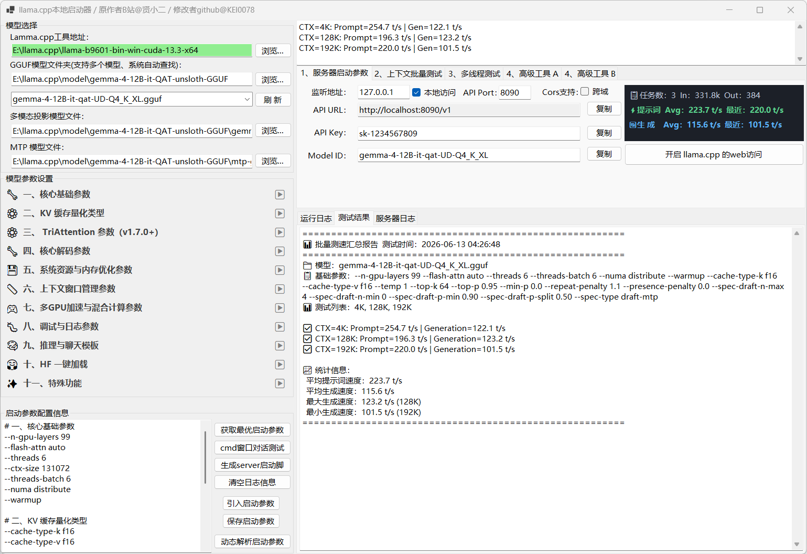

# cn.LammaForms v2.4.3 — llama.cpp 启动参数管理工具（修改版）



> **基于原作修改** · 适配 **llama.cpp b9596+** · .NET 10.0 Windows Forms

---

## 📌 这是什么？

**cn.LammaForms** 是一个 Windows 桌面 GUI 工具，用于管理 [llama.cpp](https://github.com/ggml-ai/llama.cpp) 的启动参数。它能让你直观地配置推理参数、生成启动脚本、测试模型对话、执行批处理测速等。

---

## ✨ 相对于原版的修改

### 🆕 新增功能

| 功能 | 说明 |
|------|------|
| **MTP 推测解码支持** | 自动匹配 MTP 模型文件，自动拼接 `--model-draft` 参数 |
| **可拖拽左右分隔条** | 左侧参数面板与右侧 Tab 区之间改为可拖动的 SplitContainer |
| **7 个文件路径参数支持浏览按钮** | `--chat-template-file`、`--system-prompt-file`、`--log-file`、`--lora`、`--control-vector`、`--grammar-file`、`--json-schema-file` 无需手敲路径 |
| **旧缓存兼容** | `FixKnownParamTypes()` 自动修正旧 `system.json` 中过期的参数类型 |
| **分隔符持久化** | 左右/上下分隔条位置自动保存到 `config.json`，重启后恢复 |

### 📋 新增参数分类（v2.4.0+）

| 分类 | 参数数 | 说明 |
|------|--------|------|
| **九、推理与聊天模板** 🧠 | 11 个 | `--reasoning-format`, `--chat-template`, `--system-prompt` 等 |
| **十、HuggingFace 一键加载** 🤗 | 8 个 | `--hf-repo`, `--hf-file`, `--model-url` 等 |
| **十一、特殊功能** ✨ | 11 个 | `--lora`, `--grammar`, `--json-schema`, `--rpc` 等 |

### 🎨 UI 优化

- 参数行从 4 列改为 **3 列**（去掉冗余提示栏，输入框占 70% 宽度）
- 文件路径文本框 **可编辑**（原来只读）+ 浏览按钮文字 "..." → **"浏览"**
- 分类箭头图标字体统一，视觉对齐
- 每行参数底部有 **浅灰分隔线**，与下方功能区分

### 🔧 其他改进

- 移除原版中已废弃的 `--no-affinity` 参数
- 新增约 **36 个纯开关参数**（适配 llama.cpp b9596+）
- 构建输出目录优化（`OutputPath = ..\\..\\`）

---

## 📦 构建与运行

### 环境要求

- [.NET 10.0 SDK](https://dotnet.microsoft.com/download/dotnet/10.0)
- Windows 10/11

### 编译

```bash
cd project
dotnet build cn.LammaForms.sln -c Release
```

编译产物输出到 `cn.LammaForms\build-output\` 目录（v2.4.1+ 起，csproj 已配置 OutputPath=..\..\build-output\）。

### 部署

1. 从 `cn.LammaForms\build-output\` 复制 5 个文件（`.exe` `.dll` `.pdb` `.deps.json` `.runtimeconfig.json`）到版本目录
2. 再复制到启动管理工具目录
3. 首次运行前可删除旧 `system.json` 让程序重新生成

---

## 📁 项目结构

```
cn.LammaForms/
├── Config/              # 配置管理
│   ├── AppConfig.cs     # config.json 数据模型
│   ├── ConfigManager.cs # 配置管理器
│   ├── SystemParamItem.cs
│   └── SystemParamManager.cs
├── Controls/
│   └── ParamControlFactory.cs  # 动态参数控件工厂
├── params/              # 参数定义 JSON
│   ├── llama-params.json
│   └── turboquant-params.json
├── mainFrm.cs           # 主窗体逻辑
├── mainFrm.Designer.cs  # 窗体布局
└── Program.cs           # 程序入口
```

---

## 📜 变更记录

详见 [`changelog/2026-06-12.md`](changelog/2026-06-12.md)

---

## ⚠️ 说明

- 本仓库为 **个人修改版**，基于原作者的开源代码进行适配和改进
- 原作者原始代码保存在 [`源码-作者源文件`](源码-作者源文件/) 目录下
- 修改说明详见 [`源码-作者源文件/修改说明-v2.4.0-2026-06-12.md`](源码-作者源文件/修改说明-v2.4.0-2026-06-12.md)

---

## 🙏 原作者

- **B站视频介绍**：https://www.bilibili.com/video/BV1PH5d6qELo
- **UP 主**：贤小二AI
- **原版网盘下载**：
  - 链接：https://pan.baidu.com/s/5QUVi0icMY1RMo_zH4dt76g
  - 提取码：`cn.llamaForms2026`
